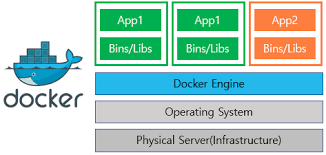

아이템 1.도커의 동작 원리
=========================
### 도커의 구조
일반적인 서버라면 운영체제 위에 프로그램이나 데이터가 직접 올라가겠지만 도커를 사용하는 경우에는 운영체제 위에 도커 엔진이 동작하고 그 위에서 컨테이너가 동작한다.

### 운영체제가 하는 일&컨테이너 안에 있는 리눅스 운영 체제
운영체제는 소프트웨어나 프로그램의 명령을 하드웨어에 전달하는 역할을 한다.

도커 엔진 아래에도 리눅스 운영체제가 있는데, 모든 컨테이너 속에 또 리눅스 운영체제(비슷한 것)가 있다. 
본래 운영체제는 '커널'이라는 부분'과 '그 외의 주변 부분'으로 구성된다.
도커에서는 컨테이너가 완전히 분리돼 있으므로 밑바탕이 되는 리눅스 운영체제의 주변 부분이 컨테이너 속 프로그램 명령을 전달 받을 수 없다.
따라서 컨테이너 속에 운영체제의 주변 부분이 들어 있어 프로그램의 명령을 전달받고 이를 밑바탕이 되는 커널에 전달하는 구조로 돼 있다.

간단하게 리눅스 운영체제 전체를 컨테이너 속에 넣으면 되지 않을까 싶지만 주변 부분만 컨테이너에 넣고 커널은 밑바탕에 있는 것을 빌려 쓰는 형태 덕분에 도커의 가장 큰 특징인 '가벼움'을 얻을 수 있다.

#### 운영체제 구조
* 커널 (Kernel)
  * 프로세스 관리: CPU 시간을 여러 프로세스에 배분하고, 프로세스의 생성, 종료, 스케줄링, 문맥 교환 등을 처리하는 커널의 핵심 기능입니다. 이를 통해 시스템 자원을 효율적으로 관리하고, 프로세스 간 충돌을 방지합니다. 
  * 메모리 관리: 커널은 가상 메모리 및 페이징을 사용해 메모리 할당과 해제를 관리합니다. 물리적 메모리와 가상 메모리 간 변환을 담당하며, 프로그램들이 메모리를 안전하고 일관성 있게 사용할 수 있도록 합니다. 
  * 파일 시스템 관리: 커널은 파일과 디렉터리의 생성, 삭제, 읽기/쓰기 및 접근 권한을 관리합니다. 파일 시스템은 사용자와 시스템 간 데이터를 안전하게 저장하고 검색하는 역할을 합니다. 
  * 입출력(I/O) 관리: 커널은 장치 드라이버를 통해 하드웨어 장치와의 통신을 관리합니다. 사용자의 명령에 따라 데이터를 송수신하며, 이를 처리하는 과정에서 하드웨어 장치와 소프트웨어 간의 상호작용을 제어합니다. 
  * 네트워크 관리: 커널은 네트워크 프로토콜을 관리하고, 데이터 전송 및 보안 관련 작업을 처리합니다. 네트워크 통신은 다른 시스템과의 데이터 교환을 가능하게 합니다. 
  * 보안 관리: 커널은 사용자 인증, 권한 제어 및 자원 접근 관리를 담당하여 시스템과 데이터를 보호합니다. 이를 통해 승인된 사용자만 시스템 자원에 접근할 수 있도록 합니다.
* 그 외 주변 부분 (User Space)
  * 사용자 인터페이스 (CLI/GUI): 일반적으로 도커 컨테이너에는 CLI 환경(예: 쉘)이 존재하며, 사용자는 이를 통해 명령을 입력하고 시스템과 상호작용할 수 있습니다. GUI는 일반적으로 컨테이너 안에서는 사용되지 않지만, 필요한 경우 GUI 지원을 설정할 수도 있습니다. 
  * 유틸리티 프로그램: 파일 관리, 프로세스 관리와 같은 기본적인 유틸리티가 컨테이너 내부에 설치됩니다. 이러한 유틸리티는 사용자와 시스템 간의 상호작용을 돕습니다. 
  * 시스템 라이브러리: 각 컨테이너는 독립적인 응용 프로그램을 실행하기 위해 시스템 라이브러리를 포함합니다. 이는 컨테이너 내의 프로그램이 커널 기능을 사용할 수 있도록 돕는 필수 요소입니다.
데몬 (Daemons): 컨테이너 내부에서 데몬 서비스(예: 웹 서버, 데이터베이스 서버)가 백그라운드에서 실행될 수 있습니다. 각 컨테이너는 독립적으로 이러한 데몬을 실행하여 자체 서비스를 제공할 수 있습니다.
