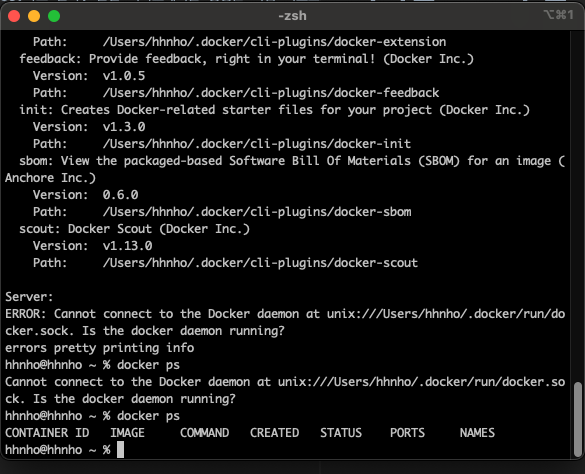
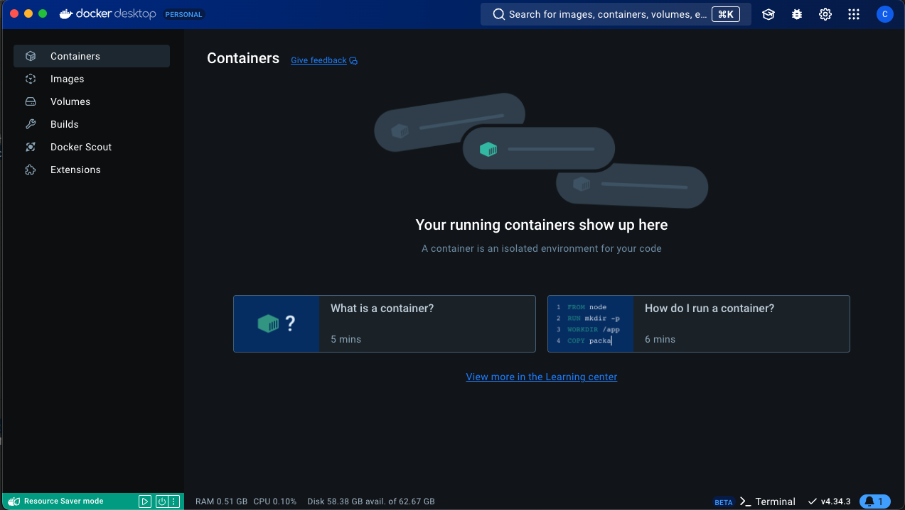

아이템 2.도커 설치
=========================
## ⭕ 도커는 간단히 설치할 수 있다
* CUI(Character User Interface)
  * CUI는 문자 기반의 인터페이스로, 주로 터미널이나 명령줄에서 명령어를 입력하여 시스템과 상호작용한다.
  * 도커는 본질적으로 CUI에 맞춰져 있으며, 대부분의 관리 작업은 터미널에서 docker 명령어를 통해 수행된다.
  * 명령어로 빠르고 효율적으로 관리 가능하며 자동화에 유리하지만, 익숙해지기 어렵다는 단점이 있다.

* GUI(Graphic User Interface)
  * GUI는 그래픽 요소를 통해 시스템과 상호작용하는 방식이다.
  * 도커에서도 GUI를 통해 도커를 관리할 수 있는 도구들이 존재한다.
  * Docker Desktop이나 Portainer로 직관적이고 사용이 쉬운 반면, 리소스 소모가 크고 세밀한 제어에 한계가 있다.

#### ✦ 도커를 설치하면 컴퓨터가 느려진다?
도커는 상주 상태로 실행되긴 하지만 컨테이너를 실행하지 않는다면 컴퓨터가 느려지는 일은 없다.
